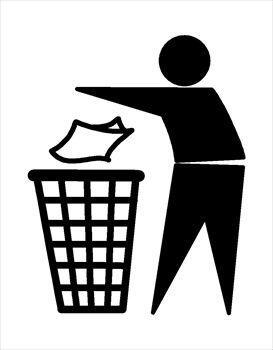
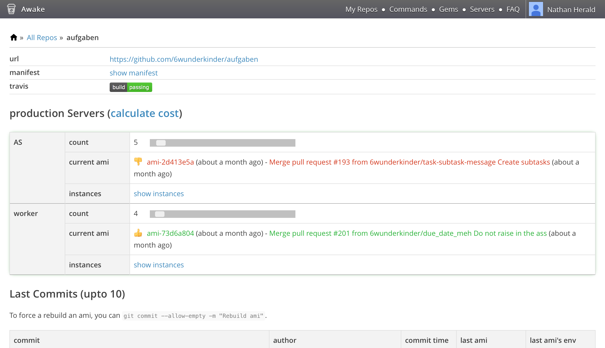
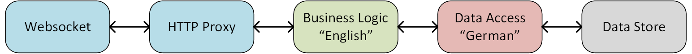
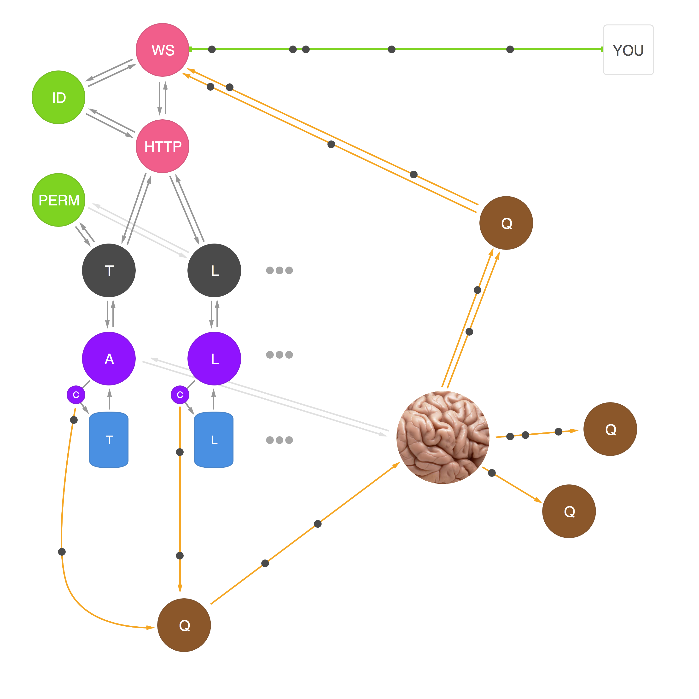

# [fit] The Wunderlist 3 Story

---

# Todo hello world
---
# What is wunderlist
		○ Todo app
		○ Technological thing

---

# The wait is over. Wundelrist 2 release.

---

# New relic slide

---

# Monlith (when I staretd)

---

# Monolitich database

---

# One backend language (ruby)

---

	# Slow / brittle test suite

---

	# Caching

---

	# Fear 

---

	# Logic buried in abstractions

---

	# FUD

---

	# Legacy (system euthanizer/blog post screen shot)

---

	# Legacy def slide

---

	# Beethoven

---

	# Standish chaos

---

	# Average life expectancy slide

---

	# Joel spolsky 10 years slide

---

	# How d you CREATE legacy software?

---

	# Design beyond human comprehension

---

	# Quote from biological systems/cellular regeneration

---

	# Homeostasis

---

	# What's a cell?

---

	# What's a system?

---

	# If we get this right, can we build systems that outlive us?

---

	# Back at the ranch

---

	# FUUUU please tell me I'm never going to hear you say this again

---

	# How do you CREATE legacy software?

---

	# Heterogeneous by default

---

	# Code is "this big"

---

	# Disposable software (mandala)

---

	# Tiny databases

---

	# Many tiny services

---

	# Tiny requests (slide from GOTO Chicago 28:00)

---

	# Re-usable services are better than Re-usable code

---

	# Nodes are disposable

---

# Immutable deployments

^ Never upgrade existing software

---

# Threw away Chef

---

	# Wake

---

# Awake

---

#  Multi-tiered architecture

---

	# Message queuing

---

---

	# Convention over configuration (shell script auto-generate rails apps)

---

	# Api-client convention over configuration

---

	# Service resolution YAML -> JSON -> auto-generated JSON -> Consul

---

	# Measure everything (church of graphs)

---

	# Librato graph

---

	# Canary deployments

---

	# Incremental "How we migrated" 46:53 GOTO Chicago

---

	# Böse Gurken

---

	# Wunderlist 3 launch (blog screenshot)

---

	# The Big Liittle Rewrite(s)

---

	# Francesco Cesarini tweet

---

# Refactor to Monolith
	
	

