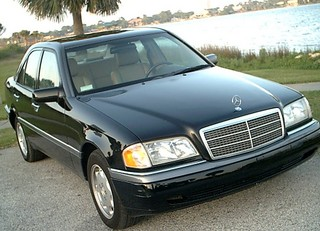
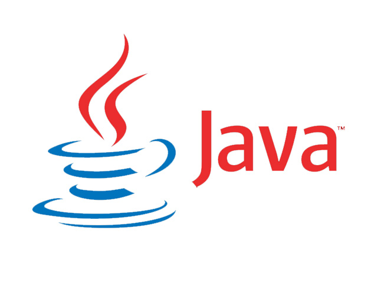

---

---

---

---

---

---

^ Fedex

---

^ Java + LDAP

---

---

---

---

^ Moved to India. Learned Hindi. "CTO"

---

---

--- 

# Picture of Dave Thomas

---

---

That was the start of my career. Since then:

* Independent consulting
* Sold two companies
* CTO
* Conference keynotes
* World travel
* Lead teams large and small
* Rails (Rails Recipes, RailsConf)
* Immutable Infrastructure
* Countless interviews, articles, book contributions, etc.
* Basically, everything

---

# TOC

* Choose your market
* Invest in your product
* Execute
* Market
* Refresh

---

---

# :boom: Choose Your Market

---

# Intention

---

# Analysis

* Which technology?
* Which business domain?
* Which team?
* Passion / Energy builders

---

# Choose your team

---

# :boom: Invest in your product

---

# Guitar/saxophone after years of ignoring it

---

# Murakami + Endurance training

---

# Business - how does it work?

---

# Mentoring

---

# Ken Smith

3 things: 

* directory service
* unix
* programming language

---

---

# Advocate

^ This is an important part of what a "mentor" turns out to be

---

# "How can I help?"

---

# Practice

--- 

http://www.slideshare.net/hansjurgenschonig/postgresql-joining-1-million-tables

---

# Read code

---

# :boom: Execution

If you forget everything else I talk about, remember this part.

^ Ultimately if you get things done better than anyone else you win

---

# Getting Things Done Feels Great

^ high pressure situations
^ tight deadlines
^ team cohesion, focus

---

# Eight hour burn

---

# The Power of Full Engagement

---

# Right Now

> Parkinson’s law is an empirical observation—not an unescapable human mandate. 

# Daily Hit

^ Do something memorable of value every day

---

# How good a job can I do today?

^ Be _perfect_ for a day
Do the "shit" work perfectly and with care

---

# :boom: Marketing

^ Marketing is a moral imperative

---

# Adventure tour guide

---

# Change the World

^ Find a bigger purpose than just the job you're hired to do

---

# Brand

^ ja

---

# Remarkability

---

# Making the hang

----

# :boom: Mainitaining your edge

---

# Avoid turning technologies into religions

---

# :monkey:

---

# :poop: Avoid Waterfall career planning

---

# The Essence oF Agility

---

# Better Than Yesterday

---

# :boom: What's this all about?

---

# When my nephew's asked for advice...

---

# There's a reason this book is called "The Passionate Programmer"

---

# Passion is a renewable energy source

---

# Passion generates energy, which generates passion, which...

---

>  I urge you to please notice when you are happy, and exclaim or murmur or think at some point, 'If this isn't nice, I don't know what is.' 

