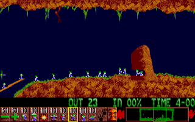

---

---

---

^ This is a tale of a fully unqualified person with nothing going for him.

---

---

---

---

---

^ Fedex

---

^ Java + LDAP

---

^ Can I make the salary of me and my wife combined?

---

---

---

^ Moved to India. Learned Hindi. "CTO"

---

---

--- 

^ Dave asked me if I would like to write about my experiences in India
Mentoring, etc.  "What did you tell them?"

---

---

^ later renamed...

---

That was the _start_ of my career. Since then:

* Independent consulting
* Sold two companies
* CTO
* Conference keynotes
* World travel
* Lead teams large and small
* Rails (Rails Recipes, RailsConf)
* Immutable Infrastructure
* Countless interviews, articles, book contributions, etc.
* Basically, everything

^ The best and HARDEST parts of my career took place after I wrote the book
^  Rails community
  Huge conferences
  And drama
  Someone called publicly for my execution
  Crazy client threatened law suit and demanded I be fired
  Death marches
  UNICORN GROWTH

---

# 10 years

---

# So what have I learned?

^ How silly I was back then to think  I knew _anything_!  10 years ago I was an idiot, right? 
Looked through the book 
Typical sophmoric problem.  TOO MUCH CONTENT.

---

# kamranince.com

^ What is the essence of this piece?  You have 10 musical ideas here. The piece needs just one!

---

# So let's look for the essence...

---

# Table of Contents

:boom: Choose your market
:boom: Invest in your product
:boom: Execute
:boom: Market
:boom: Refresh

^ Build your career like you build a product.
Blueprint for systems thinking around your career.

---

# :boom: Choose Your Market

---

# Intention

---

# Analysis

* Which technology?
* Which business domain?
* Which team?
* Passion / Energy builders

^ All of these things matter!

---

---

# Choose your team

^ I'm not sure why, but _everybody_ references this chapter.
It doesn't really resonate with me, but it must be important.

---

# :boom: Invest in your product

---

^ Guitar/saxophone after years of ignoring it
I was naturally gifted but never _invested_ in it

---

^ system.
prodigies

---

# Business - how does it work?

---

# Mentoring

^ find one. be one.

---

# Find One

Ken Smith told me 3 things: 

* directory service
* unix
* programming language

---

# Side note

Here's the list I would give a young person now:

* Hardcore Linux
* Mobile development (iOS, Android, or Windows Phone)
* Server-side Functional programming 

---

^ Remember the skill tree idea

---

# Advocate

^ This is an important part of what a "mentor" turns out to be

---

# "How can I help?"

---

# Be a Mentor

^ If you want to learn something, teach it.
Martin Fowler writes a book when he wants to learn something.
Requires you to take something apart into pieces and make sense of it.
I wrote a career book before my career really started :)

---

# Practice

^ Remember, "practice" means doing things beyond your limits. If it sounds good it's not practice. Coltrane held a single note for hours.

--- 

http://www.slideshare.net/hansjurgenschonig/postgresql-joining-1-million-tables

^ here's an example of something that stresses your boundaries in software

---

# Read code

---

# :boom: Execute

If you forget everything else I talk about, remember this part.

^ Ultimately if you get things done better than anyone else you win

---

# Be Where You're At

^ The most frustrating thing I encounter is someone with amazing skills and potential who sabotages his- or herself because they are TOO focused on being recognized and visibly leveling up.

---

# Getting Things Done Feels Great

^ high pressure situations
^ tight deadlines
^ team cohesion, focus

---

# Eight hour burn

---

---

# Do It Right Now

> Parkinson’s law is an empirical observation—not an unescapable human mandate. 

---

# Daily Hit

^ Do something memorable of value every day

---

# [fit] How good a job can I do today?

http://blog.toolshed.com/2003/07/how_good_a_job_.html

^ Be _perfect_ for a day
Do the "shit" work perfectly and with care

---

# [fit] Execution is about effectiveness over efficiency

---

# :boom: Marketing

^ Marketing is a moral imperative

---

# Change the World

^ Find a bigger purpose than just the job you're hired to do

---

^ The best marketing is a remarkable product

---

# Making the hang

^ It's uncomfortable. Chris and all musicians (touring with Frank Lowe)
Rich & Stuart Cheshire

----

# :boom: Mainitaining your edge

---

# Avoid turning technologies into religions

^ And/or identity

---

# :poop: Avoid Waterfall career planning

^ The essence of agility

---

^ How to improve things that are impossibly hard

---

^ South-Indian Monkey trap

---

# :boom: What's this all about?

---

# "What should my (daughter|son) study in University?"

^ friends or relatives ask this. I always say "It doesn't matter as long as they're excited/passsionate about it. They'll find their way"
Doing something you are NOT passionate about kills you because....

---

# There's a reason this book is called "The Passionate Programmer"

---

---

"Passion" doesn't mean OMG FOLLOW UR DREAMS!!!

---

^ Passion generates energy, which generates passion, which...

---

>  I urge you to please notice when you are happy, and exclaim or murmur or think at some point, 'If this isn't nice, I don't know what is.' 

^ It doesn't matter what you do as long as you find something that makes you happy. Don't get so busy trying to succeed that you forget to enjoy life.

---

# Thank You

@chadfowler
chad@chadfowler.com
http://chadfowler.com
